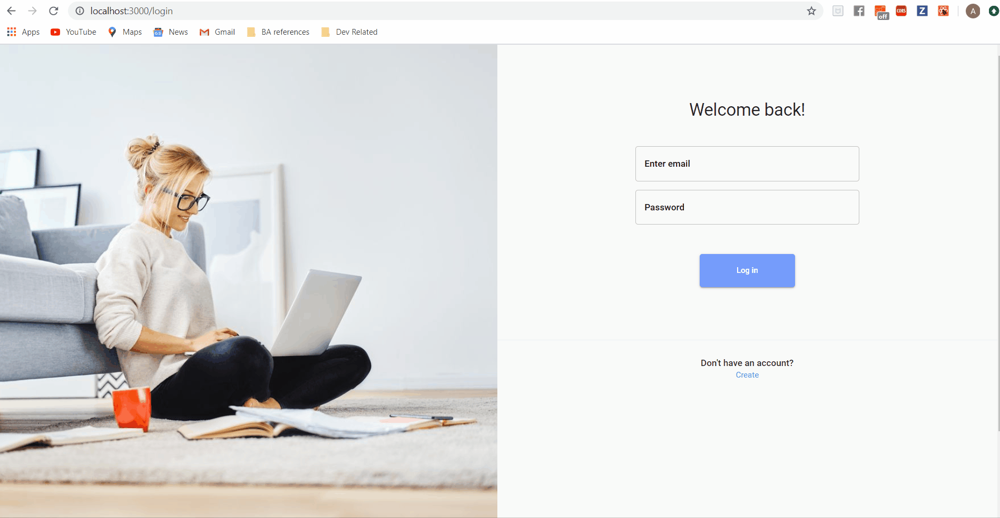

# Kanban Boards
A web app that helps users visualize their projects all in one place. You can create different boards containing columns and cards and drag cards across columns. In each of the task cards you can set deadlines, add descriptions and notes/comments about the task. You can color coat the tasks by different categories (e.g. red= urgent, blue= revist, green = easy etc.). You can also see a calendar view of your tasks, organized by deadlines.

## Tech Stack
### Frontend
* React.js - The frontend library used
* Context/Reducer Hooks - Application state management
* Material UI - Design components used for rapid prototyping with CSS-in-JS
* React Beautiful DND - The library used for drag and drop functionality
* Fullcalendar.io - The library used for the calendar component
### Backend
* Express/Node.js - The backend framework and language
* MongoDB - The database in action
* JWT & Bcrypt - Authentication mechanism along with password salting and hashing
* Twilio SendGrid - Email Delivery Service
* Amazon AWS S3 - Cloud data storage for photos and attachments

## Installations
### Prerequisites
Node.js, NPM/YARN and MongoDB

### Setting up API Keys and .env variables
This application requires API keys from:
* [Twilio SendGrid](https://sendgrid.com/)
    * Set up an account and create an API key in settings
    * Validate the account from which you will be sending emails in settings
* Add a .env file in the `server` directory with the key-value pairs matching the `.env.example` file

### Frontend
* On your terminal navigate into the projects `client` directory
* Install dependencies using `npm install`
* Start the App using `npm start`
* Application runs on port [3000](http://localhost:3000/)
### Backend
* On your terminal navigate into the project `server` directory
* Install dependencies using `npm install`
* Start the server using `npm run dev`
* Server runs on port 3001

## Features
* Login/sign up flow with e-mail address
* Create boards
* Create columns
* Create cards under each column, which represent tasks
* Add descriptions in cards (e.g. deadlines, descriptions, tags, attachments,  etc.)
* Drag cards to different columns
* Drag Columns to shift between column positions
* Convert kanban board into a calendar view
* Welcome email notification upon a new user registration

### Feature Stories
* **Logging into user account:** A user can login to their account which authenticates and redirects them to the dashboard page
 

 
* **Dragging and dropping columns and card and updating card details:** A user can drag and drop a column to a new position and can also drag and drop a card to a different column. The user can also update the details.